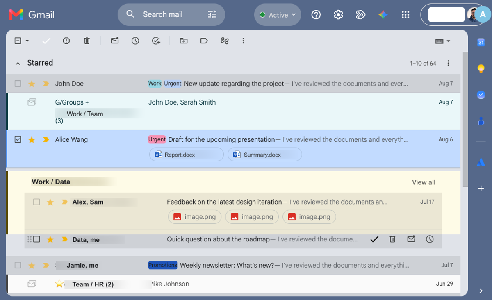
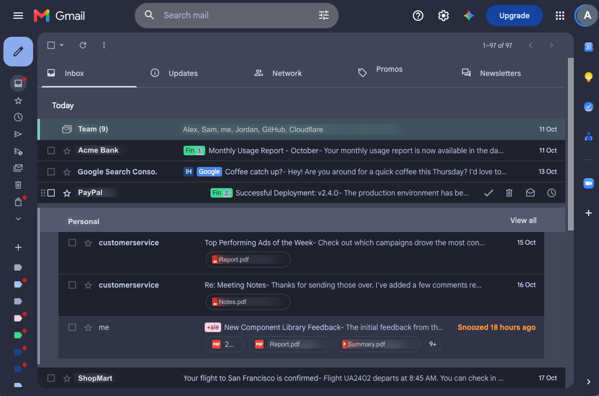

<p align="center">
  
</p>

# Inbundly: Google Inbox-style bundles for Gmail

**Inbundly** brings back the best part of Google Inbox — **bundles** — to Gmail, and keeps
going: it groups your email into tidy, collapsible bundles and adds more ways to organize
your inbox.

<p align="center">
  <a href="https://chromewebstore.google.com/detail/pbfjicjmcpogjlbpljebhhgkgfhbdcga"></a>
  <a href="https://chromewebstore.google.com/detail/pbfjicjmcpogjlbpljebhhgkgfhbdcga"></a>
  <a href="https://github.com/benoror/inbundly/blob/master/COPYING"></a>
  <a href="https://github.com/sponsors/benoror"></a>
</p>

## Install

- **Chrome / Edge / Brave:** [**Add to Chrome**](https://chromewebstore.google.com/detail/pbfjicjmcpogjlbpljebhhgkgfhbdcga) from the Chrome Web Store.
- **Firefox:** coming soon (in review on [addons.mozilla.org](https://addons.mozilla.org/firefox/addon/inbundly/)).
- **From source:** see [Setup](#setup) to build and load `dist/` as an unpacked extension.

> **Fork notice:** Inbundly is [benoror/inbundly](https://github.com/benoror/inbundly), a
> maintained, rebranded fork of [teresa-ou/inboxy](https://github.com/teresa-ou/inboxy)
> (originally by Teresa Ou), with additional options for combined-label bundles, bundle
> coloring, custom bundles, and Stylus theme-matching. Licensed GPL-3.0 (see
> [`NOTICE.md`](NOTICE.md) for the statement of changes).

## Features

* Messages with the same label are bundled together in your inbox
* Optionally bundle by the whole *set* of labels, so threads sharing labels
  A + B form their own bundle, colored by the first label (enable in Options)
* Priority bundles: force chosen labels (or label sets) to always group
  together regardless of a thread's other labels — e.g. `Bank`, `School/*`
  (subtree), or `Work + Urgent`; first matching rule wins (configure in Options)
* Custom bundles: select any messages in Gmail and click the floating
  "Bundle selected" button to group them on the fly — no Gmail label needed.
  Custom bundles override label-based grouping, stick across reloads, and sync
  with all other options to your other browsers signed into the same Chrome or
  Firefox account (`chrome.storage.sync`). Manage or delete them under
  Options → Custom bundles
* All Options page settings sync across devices the same way; a change on one
  browser updates Gmail tabs on the others without reloading the extension
* Single-item bundles are skipped by default, shown as regular messages
* Archive all bundled messages on the current page quickly
* Star a message to pin it outside of its bundle (on by default and configurable
  under Options → Bundle setup)
* Intuitive date headings
* Supports light and dark themes
* Optionally color bundles to match their Gmail label color — either a subtle
  background tint or just the left accent bar and text, both theme-aware
  (enable in Options)
* The pinned-messages toggle and per-bundle archive-all button are optional
  (hidden by default; enable them under Options → Features)
* Optional Stylus userstyle color-matching: when enabled, bundle colors are
  snapped to a detected Catppuccin theme's palette (Options → Advanced; off by
  default)

Learn more at [inbundly.com](https://inbundly.com).

## Screenshots

| Light | Dark |
|:---:|:---:|
|  |  |

## Setup

Inbundly uses webpack to bundle js files:

```bash
# Install dependencies
npm install

# Build with webpack to create dist/content.js
npm run build

# Rebuild automatically on every save (development)
npm run watch
```

The `dist` directory can then be loaded as an [unpacked extension](https://developer.chrome.com/extensions/getstarted).

### Syncing settings between computers

Settings live in `chrome.storage.sync`, which only reaches installs that share one
extension ID. Unpacked builds normally get an ID derived from the folder they're loaded
from, so the same extension on two machines would get two IDs — and two separate,
never-syncing copies of your settings. `dist/manifest.json` therefore pins a `key`
(and a Firefox `browser_specific_settings.gecko.id`), which fixes the ID no matter
where `dist/` lives:

```
cpggdbckpaoikhddngoeepdedfkleiab
```

Options → **Sync & backup** shows the ID this install is actually using — it should
match on every computer. That section also exports/imports settings as JSON, which is
the way to move them when sync is off or when the ID changed. Chrome also needs
extension syncing enabled (`chrome://settings/syncSetup`), and propagation isn't
instant.

## Feedback

Feel free to [send feedback](https://github.com/benoror/inbundly/issues) by filing an issue,
or email [support@inbundly.com](mailto:support@inbundly.com).

## Support the project

Inbundly is free and open source. If it helps tidy your inbox, consider
[sponsoring its development](https://github.com/sponsors/benoror) ♥ — it keeps the
project maintained and the lights on.

[](https://github.com/sponsors/benoror)

## Acknowledgements

* [material.io](https://material.io/resources/icons/): Icons in [dist/assets/](https://github.com/benoror/inbundly/tree/master/dist/assets/), [dist/options/assets/](https://github.com/benoror/inbundly/tree/master/dist/options/assets/), and [dist/popup/assets/](https://github.com/benoror/inbundly/tree/master/dist/popup/assets/) are modified versions of icons from material.io. The original material.io icons are licensed under [Apache License 2.0](https://www.apache.org/licenses/LICENSE-2.0.html).

## License

[GPL-3.0](https://github.com/benoror/inbundly/blob/master/COPYING). Copyright (C) 2020 [Teresa Ou](https://github.com/teresa-ou); modifications Copyright (C) 2026 [Ben Orozco](https://github.com/benoror). See [`NOTICE.md`](NOTICE.md).
